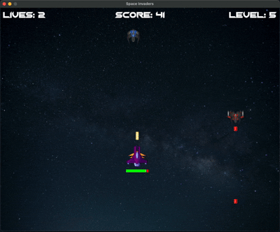

# Space Invaders

A modern Python implementation of the classic arcade game **Space Invaders**, built using the **Pygame** library. Dodge enemy lasers, shoot down enemy ships, and progress through increasingly difficult levels in this engaging space-themed shooter game.



## Features

- **Player Mechanics**:
  - Smooth movement and shooting mechanics.
  - Health bar for tracking player's health.
  - Multiple lives for extended gameplay.

- **Enemies**:
  - Multiple types of enemy ships, each with unique designs.
  - Dynamic enemy behavior and shooting patterns.
  - Increasing difficulty with higher levels.

- **Game Enhancements**:
  - Explosions and animations for visual feedback.
  - Level progression with increasing challenge.
  - Customizable game elements like speed and spawn rate.

- **User Interface**:
  - Scoreboard displaying lives, levels, and score.
  - Start and end screens for a polished user experience.


## Screenshots

(Include gameplay screenshots showcasing the game's features and visuals.)


## Technologies Used

- **Python** (v3.8+)
- **Pygame** (v2.0+)


## Requirements
Ensure you have the following installed:
- Python 3.7 or higher
- `pygame-ce==2.5.2` (dependencies listed in `requirements.txt`)

## Installation

1. Clone the repository:
    ```sh
    git clone https://github.com/tehuanmelo/space_invaders.git
    cd space_shooter
    ```

2. Create a virtual environment and activate it:
    ```sh
    python3 -m venv .venv
    source .venv/bin/activate
    ```

3. Install the required dependencies:
    ```sh
    pip install -r requirements.txt
    ```

## Running the Game

To run the game, execute the following command:
```sh
python3 code/main.py
```


## Gameplay Instructions

1. **Start the Game**:
   - Press the **SPACE** bar on the main screen to begin.

2. **Controls**:
   - **Arrow Keys**: Move the player ship.
   - **SPACE**: Shoot lasers.

3. **Goal**:
   - Avoid enemy lasers and destroy as many enemy ships as possible to increase your score.
   - Survive as long as possible to progress through levels.

4. **Game Over**:
   - The game ends when all lives are lost.

## Contributing

Contributions are welcome! Feel free to open issues or submit pull requests to enhance the game further.


## License

This project is licensed under the **MIT License**.


## Acknowledgments

- Inspired by the classic arcade game **Space Invaders**.
- Special thanks to the **Pygame** community for making game development accessible.
- A heartfelt thanks to **Carlos Alface** for providing the **SpaceShipsPack-AntuZ** assets used in this game.  
  Visit his [blog](http://carlosalface.blogspot.pt/) for more information, and feel free to reach out to him at **kalface@gmail.com**.